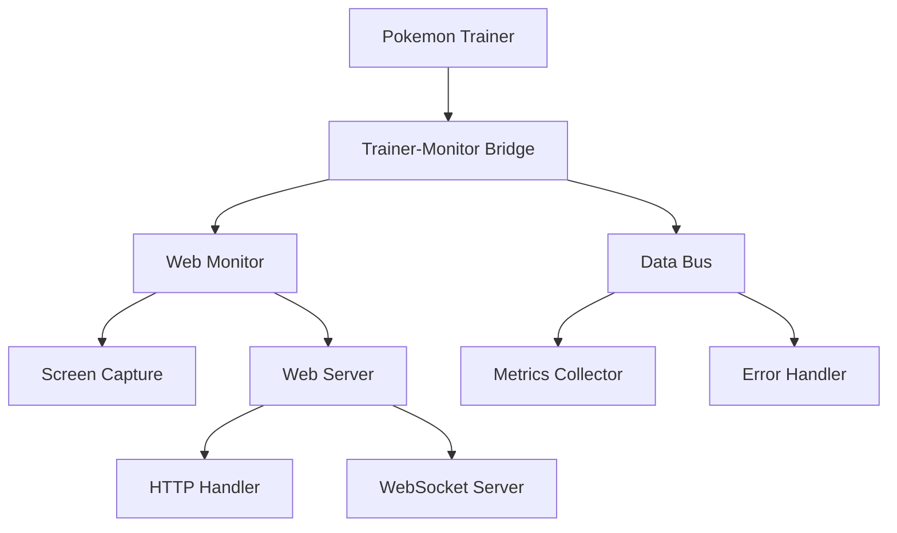
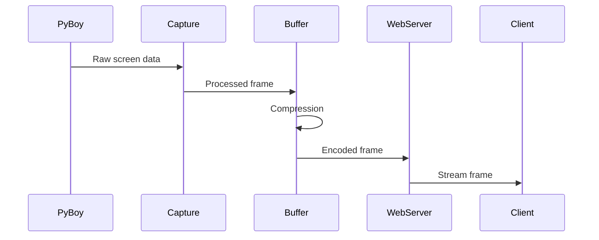
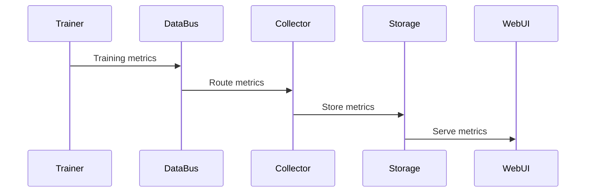
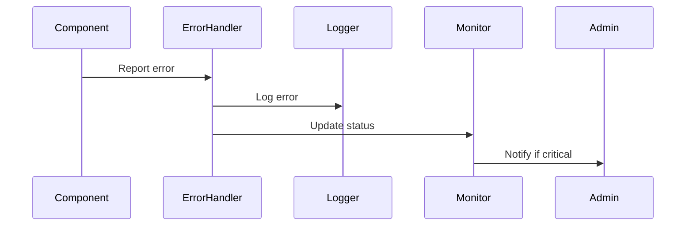

# Pokemon Crystal RL Monitoring Architecture

## Current State Analysis

The monitoring system is currently spread across multiple packages and modules with some overlapping functionality. This document analyzes the current state to inform the refactoring process.

### Core Components

#### 1. core/monitoring/
The core monitoring package provides foundational monitoring capabilities:

```
core/monitoring/
├── __init__.py      - Package init and compatibility imports
├── bridge.py        - Trainer-monitor communication bridge
├── data_bus.py      - Event bus for component communication 
├── screen_capture.py - Game screen capture utilities
└── web_server.py    - Base web server implementation
```

**Key Features:**
- Data bus for component communication
- Screen capture and streaming
- Web server infrastructure
- Trainer monitoring bridge

#### 2. core/web_monitor/
A separate web monitoring implementation:

```
core/web_monitor/
├── __init__.py      - Package initialization
├── http_handler.py  - HTTP request handling
└── monitor.py       - Main WebMonitor implementation
```

**Key Features:**
- Real-time monitoring dashboard
- HTTP API endpoints
- WebSocket communication
- Screen streaming

#### 3. Archive Code (Old Implementations)
Located in `archive/code/monitoring/`:

```
archive/code/monitoring/
├── demo_web_monitor.py
├── enhanced_web_monitor.py
├── game_stream_fixed.py
└── old_implementations/
    ├── advanced_web_monitor.py
    └── web_monitor.py
```

These files contain various iterations and experiments with monitoring functionality.

### Component Dependencies



### Issues and Overlap

1. **Duplicate Functionality**
   - Multiple screen capture implementations
   - Redundant web server setups
   - Overlapping metrics collection

2. **Inconsistent Interfaces**
   - Different monitoring interfaces between packages
   - Inconsistent error handling
   - Varying data formats

3. **Legacy Code**
   - Old implementations in archive
   - Outdated compatibility layers
   - Experimental features mixed with core code

4. **Testing Gaps**
   - Incomplete test coverage
   - Inconsistent mock implementations
   - Missing integration tests

## Data Flow Analysis

### 1. Screen Capture Flow


### 2. Metrics Collection Flow


### 3. Error Handling Flow


## Performance Considerations

1. **Memory Management**
   - Screen buffer size limits
   - Frame compression settings
   - Data retention policies

2. **CPU Usage**
   - Frame capture rate limiting
   - Efficient state processing
   - Batched metrics collection

3. **Network Optimization**
   - WebSocket event batching
   - Compressed data transmission
   - Selective updates

## Security Considerations

1. **Data Access**
   - Local-only by default
   - Optional authentication
   - Rate limiting

2. **Input Validation**
   - API parameter validation
   - Frame data verification
   - Error boundary protection

## Migration Strategy

The new unified architecture will:

1. **Consolidate Core Components**
   - Single screen capture implementation
   - Unified web server
   - Centralized metrics collection

2. **Define Clear Interfaces**
   - Base monitor interface
   - Component protocols
   - Error handling standards

3. **Improve Testing**
   - Comprehensive test suite
   - Standard mock implementations
   - Integration test framework

4. **Phase Out Legacy Code**
   - Deprecate old implementations
   - Migration documentation
   - Compatibility layers

## Next Steps

1. Create unified monitoring package with clean architecture
2. Implement core components with proper separation
3. Add comprehensive tests
4. Migrate existing code gradually
5. Update documentation and examples

The refactoring process will be iterative, ensuring backward compatibility while moving toward a more maintainable architecture.
