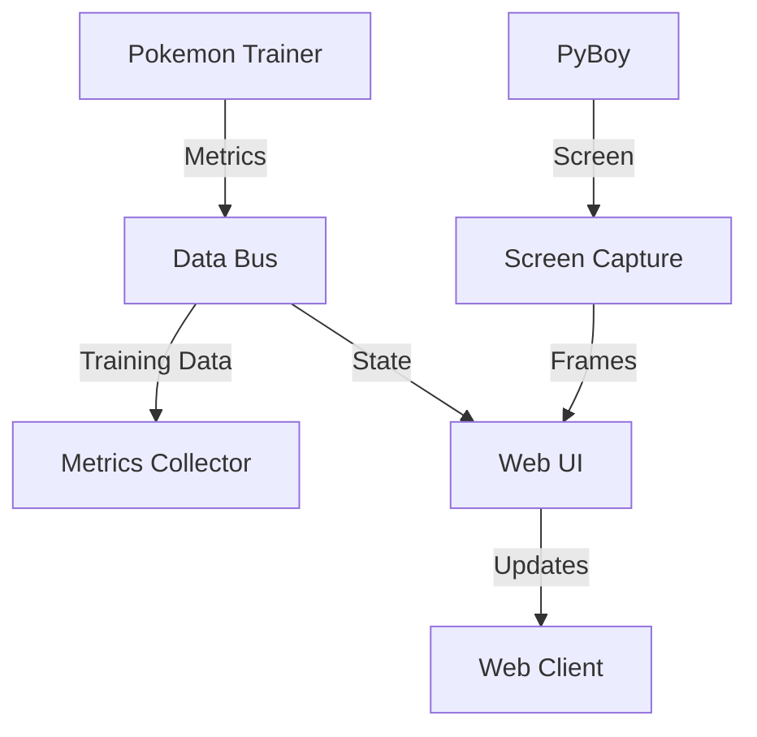

# Monitoring System Integration Plan

## Overview

This document outlines how to integrate the monitoring system refactoring into the broader project refactoring roadmap. The monitoring system will follow the same principles of modularity, clean interfaces, and component-based architecture.

## Integration with Current Progress

### Phase 2: Completed Components ✅

The refactoring has already achieved:
- WebMonitor monolith split into modular components
- Decision analyzer refactored into focused modules
- Additional duplicate code eliminated
- Interface-based architecture implemented

### Phase 2.4: Monitoring System Consolidation

Building on these successes, we will consolidate the monitoring system:

#### 1. Core Components (Phase 2.4.1)
```python
from abc import ABC, abstractmethod
from typing import Protocol, Dict, Any

# Base monitoring protocols
class MonitorComponent(Protocol):
    """Core component protocol."""
    def start(self) -> bool: ...
    def stop(self) -> bool: ...
    def get_status(self) -> Dict[str, Any]: ...

class DataPublisher(Protocol):
    """Data publication protocol."""
    def publish(self, topic: str, data: Any) -> bool: ...

class DataSubscriber(Protocol):
    """Data subscription protocol."""
    def subscribe(self, topic: str) -> bool: ...
    def handle_data(self, topic: str, data: Any) -> None: ...
```

#### 2. Component Implementation (Phase 2.4.2)

Implement concrete components:

```python
@dataclass
class ScreenCaptureConfig:
    """Screen capture configuration."""
    buffer_size: int = 10
    frame_rate: float = 30.0
    compression_quality: int = 85

class ScreenCapture(MonitorComponent):
    """Screen capture implementation."""
    def __init__(self, config: ScreenCaptureConfig):
        self.config = config
        self._capture_thread = None
        self._frame_buffer = collections.deque(maxlen=config.buffer_size)

class MetricsCollector(MonitorComponent):
    """Training metrics collection."""
    def __init__(self):
        self.metrics: Dict[str, deque] = {}
        self._collectors = []

class WebServer(MonitorComponent):
    """Web interface server."""
    def __init__(self, host: str = "localhost", port: int = 5000):
        self.app = Flask(__name__)
        self.socketio = SocketIO(self.app)
```

#### 3. Data Flow (Phase 2.4.3)



## Phase 4 Integration: Directory Reorganization

### New Monitoring Package Structure

```
monitoring/
├── __init__.py              # Package initialization
├── base.py                  # Core interfaces
├── components/              # Core components
│   ├── __init__.py
│   ├── capture.py          # Screen capture
│   ├── metrics.py          # Metrics collection
│   └── errors.py           # Error handling
├── web/                    # Web interface
│   ├── __init__.py
│   ├── server.py          # Web server
│   ├── api.py             # REST API
│   └── templates/         # Web templates
├── data/                  # Data management
│   ├── __init__.py
│   ├── bus.py            # Data bus
│   └── storage.py        # Data persistence
└── utils/                 # Utilities
    ├── __init__.py
    └── validation.py     # Data validation
```

## Implementation Plan

### 1. Core Infrastructure (Phase 4.1)

```python
# monitoring/base.py
class MonitoringSystem:
    """Main monitoring system coordinator."""
    def __init__(self, config: Dict[str, Any]):
        self.components: Dict[str, MonitorComponent] = {}
        self.data_bus = DataBus()
        self._initialize_components(config)

    def _initialize_components(self, config: Dict[str, Any]):
        """Initialize monitoring components."""
        # Screen capture
        if config.get("enable_capture"):
            capture_config = ScreenCaptureConfig(**config["capture"])
            self.components["capture"] = ScreenCapture(capture_config)

        # Metrics collector
        if config.get("enable_metrics"):
            self.components["metrics"] = MetricsCollector()

        # Web server
        if config.get("enable_web"):
            web_config = config.get("web", {})
            self.components["web"] = WebServer(**web_config)
```

### 2. Component Communication (Phase 4.2)

```python
# monitoring/data/bus.py
class DataBus:
    """Central message bus for component communication."""
    def __init__(self):
        self._subscribers: Dict[str, List[Callable]] = defaultdict(list)
        self._data_validators: Dict[str, Callable] = {}

    def publish(self, topic: str, data: Any) -> bool:
        """Publish data to subscribers."""
        # Validate data
        if topic in self._data_validators:
            if not self._data_validators[topic](data):
                return False

        # Notify subscribers
        for callback in self._subscribers[topic]:
            try:
                callback(data)
            except Exception as e:
                self._handle_callback_error(e, topic, callback)

        return True

    def subscribe(self, topic: str, callback: Callable) -> bool:
        """Subscribe to a topic."""
        self._subscribers[topic].append(callback)
        return True
```

### 3. Web Interface (Phase 4.3)

```python
# monitoring/web/server.py
class MonitoringServer:
    """Web server for monitoring interface."""
    def __init__(self, config: Dict[str, Any]):
        self.app = Flask(__name__)
        self.socketio = SocketIO(self.app)
        self._setup_routes()
        self._setup_socketio()

    def _setup_routes(self):
        """Configure HTTP routes."""
        @self.app.route("/")
        def index():
            return render_template("dashboard.html")

        @self.app.route("/api/v1/metrics")
        def get_metrics():
            return jsonify(self.metrics_collector.get_metrics())

    def _setup_socketio(self):
        """Configure WebSocket events."""
        @self.socketio.on("connect")
        def handle_connect():
            pass
```

## Migration Plan

### Phase 1: Core Components
1. Create new package structure
2. Implement base interfaces
3. Port screen capture
4. Port metrics collection

### Phase 2: Web Interface
1. Create new web server
2. Implement REST API
3. Create WebSocket handlers
4. Migrate templates

### Phase 3: Data Management
1. Implement data bus
2. Add data validation
3. Create storage system
4. Migrate existing data

### Phase 4: Integration
1. Update trainer imports
2. Add compatibility layer
3. Test functionality
4. Remove old code

## Testing Strategy

### 1. Unit Tests

```python
class TestScreenCapture:
    """Test screen capture component."""
    def test_initialization(self):
        config = ScreenCaptureConfig(buffer_size=5)
        capture = ScreenCapture(config)
        assert capture.config.buffer_size == 5

    def test_frame_capture(self):
        capture = ScreenCapture(ScreenCaptureConfig())
        capture.start()
        frame = capture.get_frame()
        assert frame is not None
```

### 2. Integration Tests

```python
class TestMonitoringSystem:
    """Test full monitoring system."""
    def test_component_initialization(self):
        config = {
            "enable_capture": True,
            "capture": {"buffer_size": 5},
            "enable_web": True,
            "web": {"port": 5000}
        }
        monitor = MonitoringSystem(config)
        assert "capture" in monitor.components
        assert "web" in monitor.components
```

## Success Metrics

### Code Quality
- No component over 500 lines
- 90% test coverage
- Clean component interfaces
- No circular dependencies

### Performance
- Memory usage under 100MB
- Frame rate over 30fps
- Web latency under 100ms
- CPU usage under 10%

### Maintainability
- Clear documentation
- No duplicate code
- Single responsibility
- Easy to test

## Summary

This monitoring integration plan:
1. Aligns with the broader refactoring goals
2. Maintains clean architecture
3. Eliminates duplication
4. Improves maintainability

The plan can be executed alongside Phase 4 of the main refactoring, providing a clean, modular monitoring system that integrates well with the improved project architecture.
