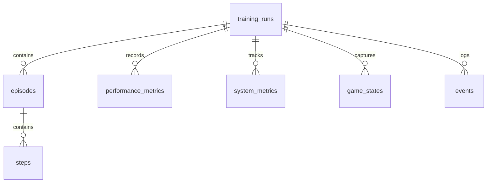

# Database Schema Reference

The monitoring system uses SQLite for data storage with the following schema design.

## Overview



## Tables

### Training Runs

```sql
CREATE TABLE training_runs (
    run_id TEXT PRIMARY KEY,
    start_time DATETIME DEFAULT CURRENT_TIMESTAMP,
    end_time DATETIME,
    status TEXT,
    total_episodes INTEGER DEFAULT 0,
    total_steps INTEGER DEFAULT 0,
    final_reward REAL,
    config TEXT,
    notes TEXT
);

CREATE INDEX idx_training_runs_status ON training_runs(status);
CREATE INDEX idx_training_runs_start_time ON training_runs(start_time);
```

Tracks individual training sessions:
- `run_id`: Unique identifier for the training run
- `start_time`: When training started
- `end_time`: When training completed (NULL if active)
- `status`: Current status (initializing/running/paused/completed/failed)
- `total_episodes`: Number of episodes completed
- `total_steps`: Total steps taken
- `final_reward`: Final reward achieved
- `config`: Training configuration as JSON
- `notes`: Additional notes or metadata

### Episodes

```sql
CREATE TABLE episodes (
    id INTEGER PRIMARY KEY AUTOINCREMENT,
    run_id TEXT NOT NULL,
    episode_number INTEGER NOT NULL,
    start_time DATETIME DEFAULT CURRENT_TIMESTAMP,
    end_time DATETIME,
    total_steps INTEGER,
    total_reward REAL,
    success BOOLEAN,
    metadata TEXT,
    FOREIGN KEY (run_id) REFERENCES training_runs(run_id),
    UNIQUE (run_id, episode_number)
);

CREATE INDEX idx_episodes_run_id ON episodes(run_id);
```

Records individual training episodes:
- `id`: Unique episode identifier
- `run_id`: Reference to training run
- `episode_number`: Episode sequence number
- `start_time`: Episode start time
- `end_time`: Episode completion time
- `total_steps`: Steps taken in episode
- `total_reward`: Total reward earned
- `success`: Whether episode completed successfully
- `metadata`: Additional episode data as JSON

### Steps

```sql
CREATE TABLE steps (
    id INTEGER PRIMARY KEY AUTOINCREMENT,
    run_id TEXT NOT NULL,
    episode_id INTEGER NOT NULL,
    step_number INTEGER NOT NULL,
    timestamp DATETIME DEFAULT CURRENT_TIMESTAMP,
    action TEXT NOT NULL,
    reward REAL,
    inference_time REAL,
    state_id INTEGER,
    FOREIGN KEY (run_id) REFERENCES training_runs(run_id),
    FOREIGN KEY (episode_id) REFERENCES episodes(id),
    FOREIGN KEY (state_id) REFERENCES game_states(id)
);

CREATE INDEX idx_steps_run_id ON steps(run_id);
CREATE INDEX idx_steps_episode_id ON steps(episode_id);
```

Records individual training steps:
- `id`: Unique step identifier
- `run_id`: Reference to training run
- `episode_id`: Reference to episode
- `step_number`: Step sequence number
- `timestamp`: When step occurred
- `action`: Action taken
- `reward`: Reward received
- `inference_time`: Time taken for decision
- `state_id`: Reference to game state

### Performance Metrics

```sql
CREATE TABLE performance_metrics (
    id INTEGER PRIMARY KEY AUTOINCREMENT,
    run_id TEXT NOT NULL,
    timestamp DATETIME DEFAULT CURRENT_TIMESTAMP,
    metric_name TEXT NOT NULL,
    metric_value REAL NOT NULL,
    FOREIGN KEY (run_id) REFERENCES training_runs(run_id)
);

CREATE INDEX idx_perf_metrics_run_id ON performance_metrics(run_id);
CREATE INDEX idx_perf_metrics_name ON performance_metrics(metric_name);
```

Stores training performance metrics:
- `id`: Unique metric identifier
- `run_id`: Reference to training run
- `timestamp`: When metric was recorded
- `metric_name`: Name of the metric
- `metric_value`: Numeric metric value

### System Metrics

```sql
CREATE TABLE system_metrics (
    id INTEGER PRIMARY KEY AUTOINCREMENT,
    run_id TEXT NOT NULL,
    timestamp DATETIME DEFAULT CURRENT_TIMESTAMP,
    cpu_percent REAL,
    memory_percent REAL,
    disk_usage REAL,
    FOREIGN KEY (run_id) REFERENCES training_runs(run_id)
);

CREATE INDEX idx_sys_metrics_run_id ON system_metrics(run_id);
```

Tracks system resource usage:
- `id`: Unique metric identifier
- `run_id`: Reference to training run
- `timestamp`: When metrics were recorded
- `cpu_percent`: CPU usage percentage
- `memory_percent`: Memory usage percentage
- `disk_usage`: Disk usage percentage

### Game States

```sql
CREATE TABLE game_states (
    id INTEGER PRIMARY KEY AUTOINCREMENT,
    run_id TEXT NOT NULL,
    timestamp DATETIME DEFAULT CURRENT_TIMESTAMP,
    frame_number INTEGER,
    map_id INTEGER,
    player_x INTEGER,
    player_y INTEGER,
    state_data TEXT,
    FOREIGN KEY (run_id) REFERENCES training_runs(run_id)
);

CREATE INDEX idx_game_states_run_id ON game_states(run_id);
CREATE INDEX idx_game_states_frame ON game_states(frame_number);
```

Captures game state snapshots:
- `id`: Unique state identifier
- `run_id`: Reference to training run
- `timestamp`: When state was captured
- `frame_number`: Game frame number
- `map_id`: Current map identifier
- `player_x`: Player X coordinate
- `player_y`: Player Y coordinate
- `state_data`: Additional state data as JSON

### Events

```sql
CREATE TABLE events (
    id INTEGER PRIMARY KEY AUTOINCREMENT,
    run_id TEXT NOT NULL,
    timestamp DATETIME DEFAULT CURRENT_TIMESTAMP,
    event_type TEXT NOT NULL,
    event_data TEXT,
    FOREIGN KEY (run_id) REFERENCES training_runs(run_id)
);

CREATE INDEX idx_events_run_id ON events(run_id);
CREATE INDEX idx_events_type ON events(event_type);
```

Records training events and logs:
- `id`: Unique event identifier
- `run_id`: Reference to training run
- `timestamp`: When event occurred
- `event_type`: Type of event
- `event_data`: Event details as JSON

## Common Queries

### Training Run Summary

```sql
SELECT 
    run_id,
    start_time,
    end_time,
    status,
    total_episodes,
    total_steps,
    final_reward,
    json_extract(config, '$.learning_rate') as learning_rate
FROM training_runs
WHERE status = 'completed'
ORDER BY start_time DESC
LIMIT 10;
```

### Episode Performance

```sql
SELECT 
    e.episode_number,
    e.total_steps,
    e.total_reward,
    e.success,
    json_extract(e.metadata, '$.completion') as completion
FROM episodes e
WHERE e.run_id = ?
ORDER BY e.episode_number;
```

### Recent Metrics

```sql
SELECT 
    timestamp,
    metric_name,
    metric_value
FROM performance_metrics
WHERE run_id = ?
    AND timestamp >= datetime('now', '-1 hour')
ORDER BY timestamp;
```

### Event Timeline

```sql
SELECT 
    timestamp,
    event_type,
    event_data
FROM events
WHERE run_id = ?
    AND event_type IN ('achievement', 'error', 'milestone')
ORDER BY timestamp;
```

## Schema Version Management

The schema version is tracked using SQLite's user_version pragma:

```sql
-- Get current version
PRAGMA user_version;

-- Set version after migration
PRAGMA user_version = 1;
```

## Maintenance

### Cleanup Old Data

```sql
-- Remove old training runs and related data
DELETE FROM training_runs 
WHERE end_time < datetime('now', '-30 days');

-- Remove old metrics while keeping recent data
DELETE FROM performance_metrics
WHERE timestamp < datetime('now', '-7 days')
    AND run_id NOT IN (
        SELECT run_id 
        FROM training_runs 
        WHERE status = 'running'
    );
```

### Optimize Database

```sql
-- Optimize indices and reclaim space
VACUUM;
ANALYZE;
```

## Backup and Recovery

### Create Backup

```sql
-- Backup to file
.backup 'backup.db'

-- Vacuum into backup
VACUUM INTO 'backup.db';
```

### Restore from Backup

```sql
-- Restore from file
.restore 'backup.db'
```
